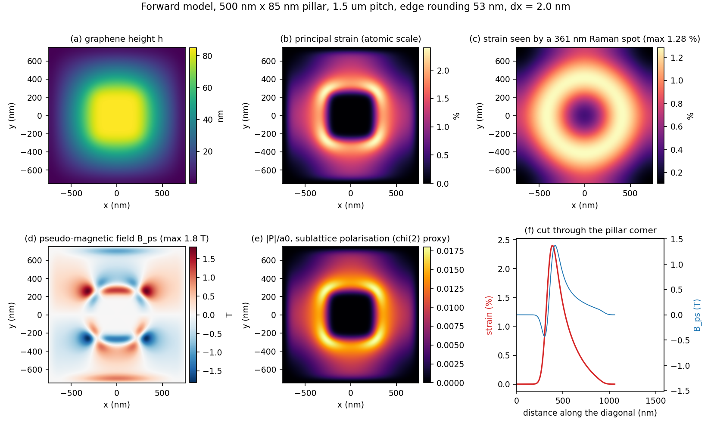
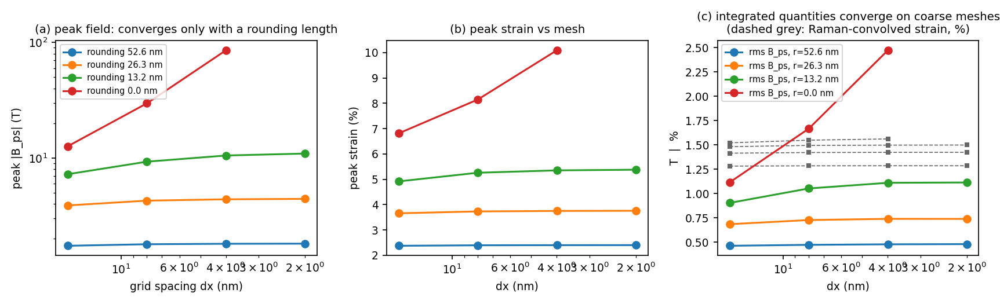
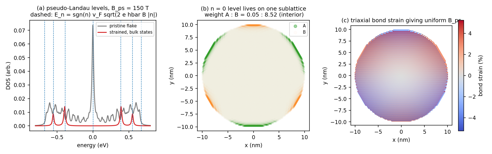
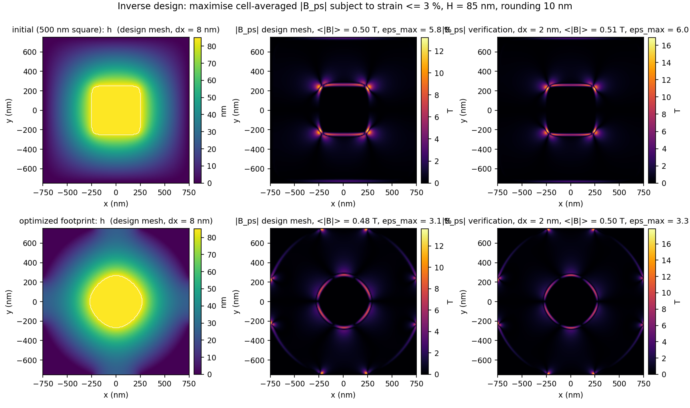
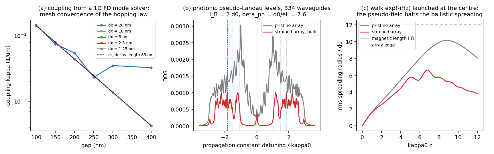

# strainscape

Strain -> pseudo-magnetic-field pipeline for graphene on nanopillar arrays, with a
mesh-calibration study, tight-binding validation, a small inverse-design loop, and a
photonic twin (coupled-waveguide honeycomb array). Pure NumPy / SciPy, runs on a laptop.

Written while reading three papers from the Nam group
([Kang 2021](https://doi.org/10.1038/s41467-021-25304-0),
[Lu 2023](https://doi.org/10.1038/s41467-023-38344-5),
[Kim 2023](https://doi.org/10.1038/s41467-023-40140-0)); the one-page research idea that came
out of it is in [IDEA.md](IDEA.md), the model in [docs/model.md](docs/model.md).

## Results in one screen

| quantity (500 nm x 85 nm pillar, 1.5 um pitch) | value | reference |
|---|---|---|
| edge rounding fitted so that peak strain = 2.4 % | 53 nm | Lu 2023 reports 2.4 % (tight binding) |
| strain seen by a 361 nm Raman spot | 1.28 % | Lu 2023 measures 1.26 % (independent check) |
| peak `B_ps` at that rounding | 1.8 T | Lu 2023 quotes ~30 T at atomic resolution |
| rms `B_ps` over the tent | 0.48 T | Kang 2021 fits an average of ~25 T |
| peak `B_ps` vs rounding `r` | ~ `r^-1.3` | 30 T needs `r ~ 6 nm` |
| peak `B_ps` with `r = 0`, dx = 16 / 8 / 4 nm | 13 / 30 / 86 T | does not converge |
| tight-binding Landau levels vs `E_n = v_F sqrt(2 e hbar B n)` | within 1 % | n = +-1, +-2 at B = 150 T |
| weight of the n = 0 level on sublattice A : B | 0.05 : 8.5 | SHG mechanism of Lu 2023 |
| `curl A` vs `-(2 beta / 3 a0^2) div P` | equal to 1e-15 | Eq. 3 of Lu 2023 |
| inverse design, 10 nm edge, strain cap 3 %: square vs optimised | 6.0 % -> 3.3 % strain at 0.51 -> 0.50 T mean field | shape cannot raise the mean field; edge sharpness and edge density can |
| photonic twin: coupling law from mode solver | `kappa = kappa0 exp(-gap/85 nm)`, converged < 1 % at dx = 10 nm | dx = 20 nm aliases beyond 250 nm gaps |
| photonic pseudo-Landau level n = 1 (334 waveguides) | at 1.05 kappa0 vs predicted 1.06 kappa0 | Rechtsman 2013 physics on a PIC |
| rms spreading of a launched beam, pristine vs strained | 10 d0 vs 6.6 d0 (max), 8.1 vs 3.9 d0 (final) | pseudo-field halts ballistic spreading |







## What each module does

| module | content |
|---|---|
| `topography.py` | super-elliptic pillar footprint with radial harmonics; membrane drape by a periodic Laplace solve with Shortley-Weller cut-cell boundaries; edge rounding |
| `elasticity.py` | small-slope Foeppl-von Karman strain; optional exact FFT relaxation of the in-plane displacement (plane stress) |
| `pmf.py` | gauge field, `B_ps`, sublattice polarisation `P`, the identity `B_ps = -(2 beta/3 a0^2) div P`, exciton strain potential |
| `forward.py` | one call from pillar to `h, eps, B_ps, P`; Raman-spot convolution; summary metrics |
| `calibration.py` | fit rounding / tent width to reported strain; mesh sweeps |
| `tightbinding.py` | honeycomb flake, strain-modified hoppings, shift-invert spectrum, Landau-level formula, sublattice weights, average mixing matrix |
| `inverse.py` | design space (side, corner sharpness, tent width, 4- and 8-fold harmonics), objectives (mean field, coverage, uniformity), Powell on the true drape or L-BFGS-B on a smooth surrogate, fine-mesh verification |
| `photonic.py` | 1D FD mode solver for two Si slabs -> coupling law with mesh convergence; honeycomb waveguide array with pseudo-magnetic field; `exp(-iHz)` propagation |

## Run

```bash
pip install -r requirements.txt
python -m pytest -q                      # 13 tests, ~10 s
python scripts/make_figures.py           # all figures and results/*.json, ~8 min
python scripts/make_figures.py tb        # or one of: forward mesh tb inverse photonic
```

Minimal use:

```python
from strainscape import Grid, Pillar, run_forward, summarize
pil = Pillar(half_side=250e-9, power=8, height=85e-9, tent_width=488e-9)
res = run_forward(pil, Grid(1.5e-6, 376), rounding=53e-9)
print(summarize(res))          # peak strain, Raman strain, peak and rms B_ps, ...
res.B, res.Px, res.Py, res.h   # fields on the grid
```

Any measured height map can replace the drape: `run_forward(pil, grid, h=h_afm)`.

## Lessons the mesh study taught

1. A pixelated pillar mask is a staircase of artificial corners; peak strain then grows under
   refinement no matter how fine the mesh. Sub-pixel (cut-cell) boundary placement removes it.
2. With a finite edge rounding `r`, peak strain and peak field converge once `dx <= r/4`.
   With `r = 0` the peak field grows like `dx^-1.3` forever, because the field is a
   derivative of a strain jump.
3. Integrated observables (Raman-convolved strain, rms field over the tent) converge on the
   coarsest mesh. Compare models on those, or quote `r` with any peak value.

## Relation to the papers

* Kang 2021 / Lu 2023 geometry, constants (`beta = 3`, `a0 = 0.142 nm`), gauge-field convention
  and the `B_ps`-`P` identity are used verbatim; the Raman spot (Eq. 2 of Kang 2021) is applied
  to the model strain for a like-for-like comparison.
* Kim 2023 motivated the mesh-convergence habit; a Q-factor-vs-mesh study of the nanowire
  cavity is the natural FDTD follow-up (Tidy3D or Meep), the pipeline here is FDTD-free.
* The photonic twin follows Rechtsman et al. (Nat. Photon. 2013) and Barczyk et al.
  (Nat. Photon. 2024) and connects the strain problem to coupled-waveguide arrays on a PIC.

## Limitations

Continuum small-slope membrane without adhesion or bending mechanics; tent width and edge
rounding are calibrated, not predicted; scalar 1D slab coupling in the photonic twin; the
inverse design has five parameters and finite-difference / derivative-free optimisation
(an adjoint is the obvious next step). See [docs/model.md](docs/model.md), section 8.

## Citation

Musung Kang, *strainscape: mesh-calibrated strain-to-pseudo-magnetic-field pipeline for graphene
on nanopillars*, 2026, https://github.com/soorig/strainscape. MIT licence.
